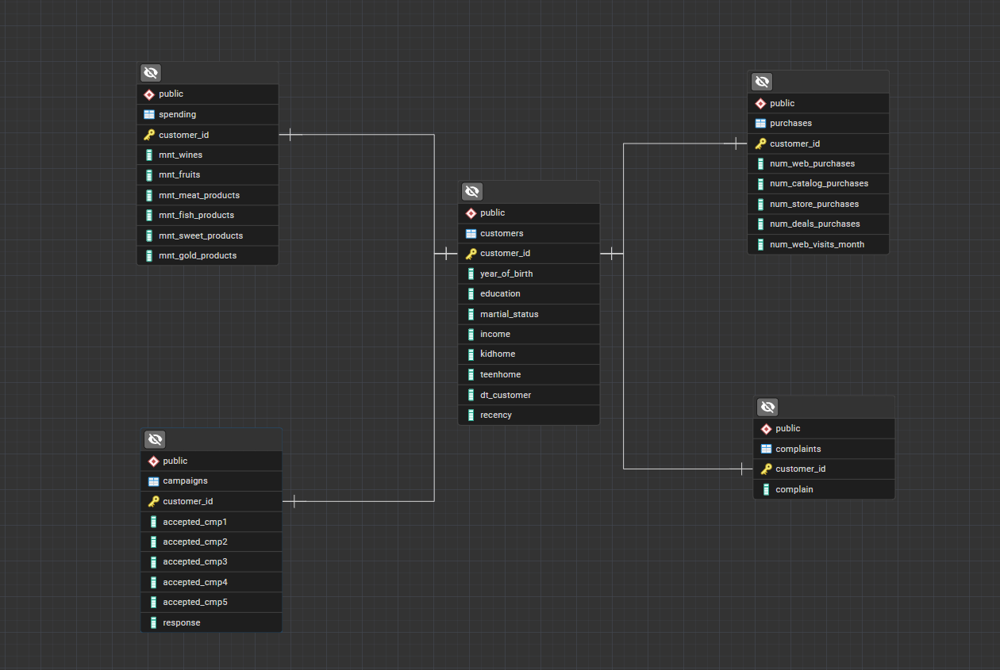

# 📊 Customer Segmentation & Marketing Campaign Analysis using SQL

<p align="center">


</p>

---

# 📌 Project Overview

This project demonstrates an end-to-end SQL analysis workflow using a real-world **Marketing Campaign** dataset.

The project covers the complete journey from cleaning raw data and designing a normalized relational database to solving practical business problems using SQL.

The primary objective of this repository is to demonstrate strong SQL skills through database normalization, ETL, analytical SQL queries, Window Functions, and business-driven customer analysis.

---

# 🚀 Project Highlights

✅ PostgreSQL Database Design

✅ Data Cleaning & ETL

✅ Database Normalization

✅ Beginner SQL

✅ Intermediate SQL

✅ Advanced SQL

✅ Window Functions

✅ Customer Segmentation

✅ Marketing Campaign Analysis

✅ Business Decision Making using SQL

---

# 🎯 Project Objectives

The objectives of this project are to:

- Build a normalized relational database from raw marketing data.
- Perform ETL (Extract, Transform, Load) using Python and SQL.
- Practice SQL concepts from beginner to advanced level.
- Solve real-world business problems using SQL.
- Analyze customer purchasing behavior.
- Evaluate marketing campaign effectiveness.
- Generate actionable business insights.
- Build a portfolio-ready SQL project for Data Analyst roles.

---

# 🛠️ Technologies Used

| Category | Technology |
|----------|------------|
| Database | PostgreSQL |
| Query Language | SQL |
| Data Cleaning | Python |
| Libraries | Pandas, NumPy |
| Environment | Jupyter Notebook |

---

# 📂 Dataset

**Dataset:** Marketing Campaign Dataset

The dataset contains customer information including:

- Customer Demographics
- Education
- Marital Status
- Income
- Household Information
- Product Spending
- Purchase Channels
- Marketing Campaign Responses
- Customer Complaints

---

# 🗄️ Database Design

The raw dataset was normalized into multiple relational tables to reduce redundancy and improve data consistency.

### Tables

- Customers
- Spending
- Purchases
- Campaigns
- Complaints

---

# 🖼️ Entity Relationship Diagram (ERD)


<p align="center">
    
</p>


---

# 🔄 ETL Workflow

```
Raw CSV Dataset
        │
        ▼
Python Data Cleaning
        │
        ▼
PostgreSQL Staging Table
        │
        ▼
SQL Transformations
        │
        ▼
Normalized Database
        │
        ▼
SQL Analysis
        │
        ▼
Business Insights
        │
        ▼
Business Recommendations
```

---

# 📁 Repository Structure

```
customer_segmentation_sql
│
├── 📁 data
│
├── 📁 images
│   └── er_diagram.png
│
├── 📁 Normalisation_and_ETL
│
├── 📁 sql_analysis_basics
│
├── 📁 sql_analysis_intermediate
│
├── 📁 sql_analysis_advanced
│
├── 📁 sql_analysis_windows_functions
│
├── 📁 sql_analysis_business_decisions_and_strategy
│
├── 📄 ER_diagram.pgerd
│
└── 📄 README.md
```

---

# 📚 SQL Topics Covered

## ✅ Beginner SQL

- SELECT
- WHERE
- ORDER BY
- GROUP BY
- HAVING
- DISTINCT
- Aggregate Functions
- LIMIT

---

## ✅ Intermediate SQL

- INNER JOIN
- LEFT JOIN
- RIGHT JOIN
- SELF JOIN
- CASE Statements
- UNION
- UNION ALL
- Subqueries
- Correlated Subqueries
- Common Table Expressions (CTEs)

---

## ✅ Advanced SQL

- Complex CTEs
- Nested Queries
- Multi-table Analysis
- Customer Analytics
- Revenue Analysis
- Marketing Analysis
- Customer Insights

---

## ✅ Window Functions

- ROW_NUMBER()
- RANK()
- DENSE_RANK()
- NTILE()
- LAG()
- LEAD()
- FIRST_VALUE()
- LAST_VALUE()
- Running Totals
- Rolling Averages
- Partition-based Analysis

---

## ✅ Business Analysis

This project answers practical business questions using SQL, including:

- Which customer segment should receive premium (non-discounted) offers?
- Which customers should be targeted for digital-first campaigns?
- Which low-spending customers show high campaign responsiveness?
- Which customers are unprofitable and should be deprioritized?
- What customer strategy should the company adopt to maximize revenue while reducing marketing waste?

---

# 💼 Business Recommendations

<<<<<<< HEAD
```
customer_segmentation_sql
│
├── 📁 data
│   ├── Raw Dataset
│   └── Cleaned Dataset
│
├── 📁 Normalisation & ETL
│   ├── Database Schema
│   ├── Table Creation Scripts
│   ├── ETL Queries
│   └── Data Loading Scripts
│
├── 📁 sql_analysis_basics
│   └── Beginner SQL Queries
│
├── 📁 sql_analysis_intermediate
│   └── Intermediate SQL Queries
│
├── 📁 sql_analysis_advanced
│   └── Advanced SQL Queries
│
├── 📁 sql_analysis_windows_functions
│   └── Window Functions SQL Queries
│
├── 📁 sql_analysis_business_decisions_&_strategy
│   └── Business Analysis SQL Queries
│
└── 📄 README.md
```
=======
Based on the SQL analysis, the following business strategies are recommended:

### Customer Retention

- Prioritize resolving customer complaints to improve customer satisfaction and reduce churn.
- Introduce a loyalty rewards program to encourage repeat purchases.

### Sales & Revenue Growth

- Introduce Buy Now, Pay Later (BNPL) or EMI payment options for eligible customers.
- Promote premium wines, meat products, and other high-value products to high-income customers.
- Introduce EMI or financing options for gold products to increase conversions.

### Marketing Strategy

- Focus campaigns on customers with a strong history of accepting previous marketing campaigns.
- Continue nurturing customers who responded positively to the latest campaign.
- Reduce marketing expenditure on consistently low-spending and low-engagement customers.
- Personalize marketing campaigns based on customer purchasing behavior.

### Digital Transformation

- Encourage customers who primarily shop in physical stores to adopt digital purchasing through personalized online promotions.

### Long-Term Customer Growth

- Introduce student discounts and "Back-to-College" campaigns to build early brand loyalty.
- Expand the product portfolio to better serve customers from diverse demographic and income groups.

### Overall Strategy

Focus on customer retention, personalized marketing, flexible payment options, digital transformation, and data-driven customer segmentation to maximize revenue while minimizing unnecessary marketing costs.

>>>>>>> ed3219d (Finalize SQL project with business analysis and updated documentation)
---

# 🧠 SQL Skills Demonstrated

- Database Design
- Data Cleaning
- ETL Development
- Data Normalization
- SQL Fundamentals
- Joins
- Aggregate Functions
- CASE Statements
- Subqueries
- Common Table Expressions (CTEs)
- Window Functions
- Ranking Functions
- Customer Segmentation
- Marketing Analytics
- Business Analytics
- Analytical Problem Solving

---

# 🚀 Future Improvements

Future enhancements planned for this project include:

- SQL Query Optimization
- Indexing & Performance Tuning
- Views
- Materialized Views
- Stored Procedures
- Additional Business Case Studies
- End-to-End Power BI Dashboard (to be developed in a separate repository)

---

# 🏁 Conclusion

This project demonstrates how SQL can be used to transform raw marketing data into meaningful business insights.

By combining database normalization, ETL, advanced SQL querying, Window Functions, and business-focused analysis, the project showcases practical skills commonly required in Data Analyst roles.

The repository reflects not only technical SQL proficiency but also the ability to translate data into actionable business recommendations for decision-making.

---

<<<<<<< HEAD
## ⭐ Future Enhancements

Upcoming updates include:

- Business Analysis SQL Queries
- SQL Query Optimization Techniques
- Stored Procedures
- Views & Materialized Views
- Indexing and Performance Tuning
- Dashboard Integration with Power BI/Tableau

---

⭐ **If you found this project helpful, feel free to explore the queries and check back for future updates as more real-world business analysis problems are added.**
=======
## ⭐ If you found this project useful, consider giving it a star and exploring the SQL queries included in this repository.
>>>>>>> ed3219d (Finalize SQL project with business analysis and updated documentation)
